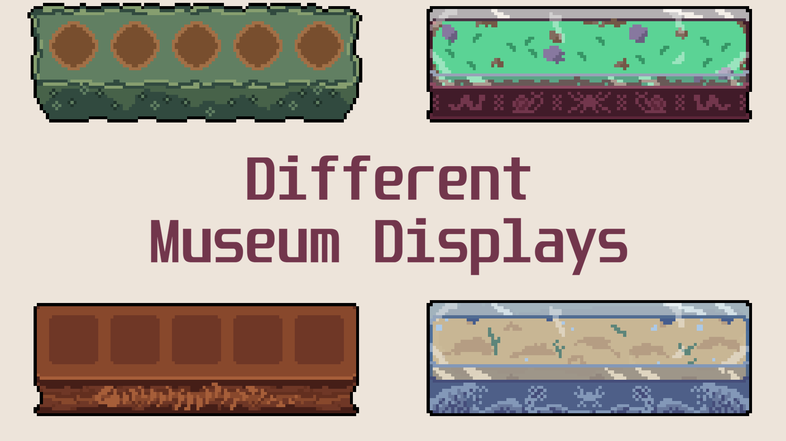
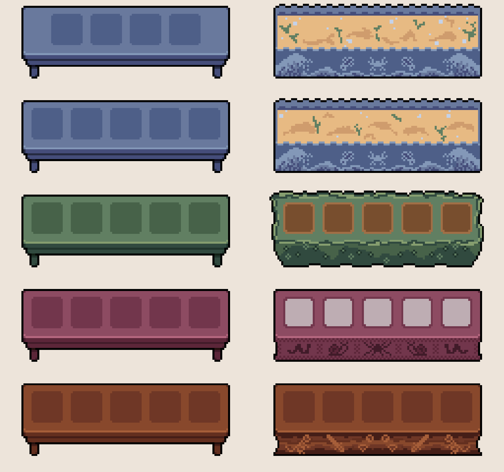
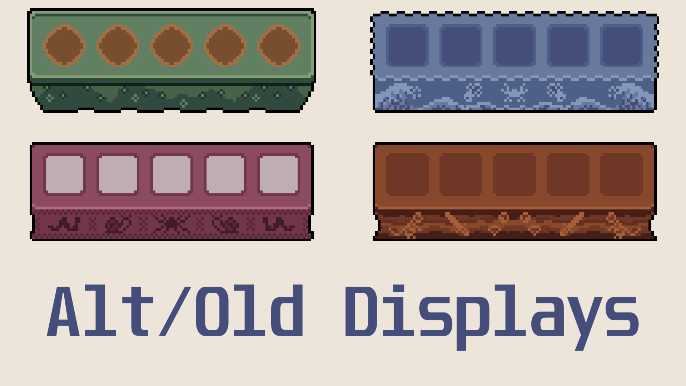

# Fields of Mistria - Different Museum Displays

Adds new museum display tables for variety (differently carved for fish, flora, and insect)

## Description

Thought it would be nice to have different sets of museum displays instead of the same table recolored. Added 2 for fish, and one for flora and insect displays.

## Installation Instructions

1. Unzip file in mods folder `C:\Program Files (x86)\Steam\steamapps\common\Fields of Mistria\mods`
2. Install using [MOMI](https://github.com/Garethp/Mods-of-Mistria-Installer) (>= 0.15 ver required)

## Comparison

## Optional Alt/Old Designs

